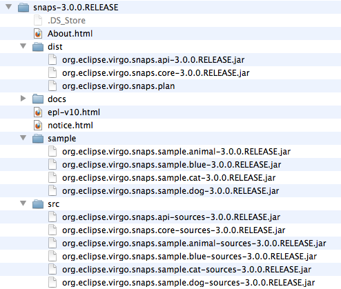
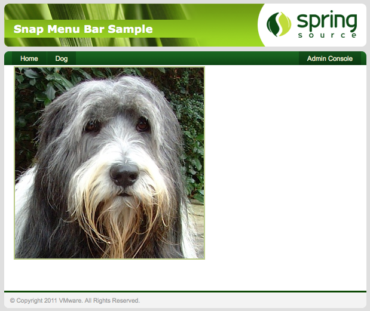

[[installation]]
== Installing Virgo Snaps

[[installation-zip]]
=== Installing from the Zip Download

VS is distributed as a Zip file. This can be
downloaded from http://www.eclipse.org/virgo/download/[here].

Once the Zip file is unpacked you will find several things inside,
including a copy of this documentation in the `docs` folder. The layout
is shown below.

Take the bundles and plan in the `dist` folder and place them in either
the `/repository/usr` or `/repository/ext` folder of your Virgo install.
Later you need the bundles in the `sample` folder. If you wish to view
the source for VS or its sample, then these are
in the `src` folder.

In order to start the Snaps system as a part of your
Virgo Server for Apache Tomcat, the Snaps plan needs to be referenced from the
`initialArtifacts` property. This is located in the config file at
`${SERVER_HOME}/config/org.eclipse.virgo.kernel.userregion.properties`.
The property should be extended like this.

....
initialArtifacts=repository:plan/org.eclipse.virgo.kernel.userregion.springdm, 
        repository:plan/org.eclipse.virgo.web.tomcat, 
        repository:plan/org.eclipse.virgo.snaps
....

Now you are ready to check that Snaps is working.

[[installation-post]]
=== Verifying it's working

The sample application in the Zip file demonstrates all of the features
of Snaps. You will cover this application in detail later, but for now
install it to verify that you have a working Snaps install. Start the
server up and check the output it produces contains the following:

....
<DE0004I> Starting plan 'org.eclipse.virgo.snaps' version '3.0.0'. 
<DE0004I> Starting bundle 'org.eclipse.virgo.snaps.api' version '[version]'. 
<DE0005I> Started bundle 'org.eclipse.virgo.snaps.api' version '[version]'. 
<DE0004I> Starting bundle 'org.eclipse.virgo.snaps.core' version '[version]'. 
<DE0005I> Started bundle 'org.eclipse.virgo.snaps.core' version '[version]'. 
<DE0005I> Started plan 'org.eclipse.virgo.snaps' version '3.0.0'.
....

Open up the Virgo Admin Console by navigating to
`http://localhost:8080/admin` and then go to the artifacts tab to deploy
some new bundles. The first bundle to deploy is located at
`/sample/org.eclipse.virgo.snaps.sample.animal-[version].jar`,
select it in the browser and upload. In the terminal window you started
the Virgo Server for Apache Tomcat in you should see the usual messages about the
bundle starting and this message:

....
<SN0000I> Host created for path '/animal-menu-bar'
....

This shows that the host has been registered and is ready for Snaps to
attach to it. To view the application take your browser to
`http://localhost:8080/animal-menu-bar/`. You should be presented with a
green looking page that has a menu bar with two links on it. One will
take you to the page you are currently on while the other goes back to
the admin page.

This is all very nice, but it's time to deploy another snap that will
dynamicaly add some extra content to the app. The next bundle to deploy
is located at
`/sample/org.eclipse.virgo.snaps.sample.dog-[version].jar`.
Deploy it the same way as the last one using the admin console and check
the messages to verify it has been bound to the host:

....
<SN0010I> Snap bound to path '/animal-menu-bar/dog' 
....

In your browser, go back to the application and refresh the page and a
new menu item should now be present. If you click it a new page will
load with content from the newly installed snap. In this case a picture
of a dog.

You have now verified that your install is working and can continue on
to learn how Snaps works and how you can use it to break up your web
applications.
