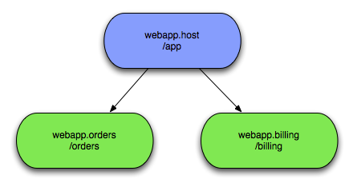

[[introduction]]
== Introduction

This Guide covers Virgo Snaps and assumes you are already
familiar with OSGi and Eclipse Virgo. See link:#further-reading[here].

[[introduction-concepts]]
=== Concepts

Using Virgo Snaps, or VS for short, you
can construct a web application from multiple OSGi bundles, each of
which serves up content for a distinct sub-portion of your application's
URL space. VS applications are arranged in a
parent/child structure, with each application having at most one
top-level parent, and zero or more children/grand children and so on.
Parents are referred to as the hosts, children as snaps.

Here you see that any `HTTP` requests for '/app' will be dealt with by
the host bundle while '/app/orders' and '/app/billing' will be dealt
with by their respective snaps bundles. Each host/snap can use
completely different web technologies to deal with the requests,
Virgo Snaps places no restrictions on your choices. The
developer decides how to split the application up and how closely to
couple the host and various snaps. VS has been
designed to be as un-invasive as possible while still making it easy to
share information between the host and its snaps.

[[introduction-prereqs]]
=== Prerequisites

VS requires Virgo Server for Apache Tomcat and Java SE 6
or later to be installed. Java is available from http://www.java.com/
and elsewhere. Virgo Server for Apache Tomcat is available from
http://www.eclipse.org/virgo/download/[here].
