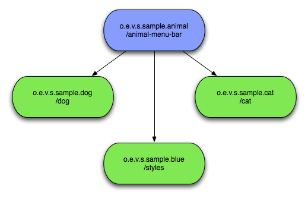
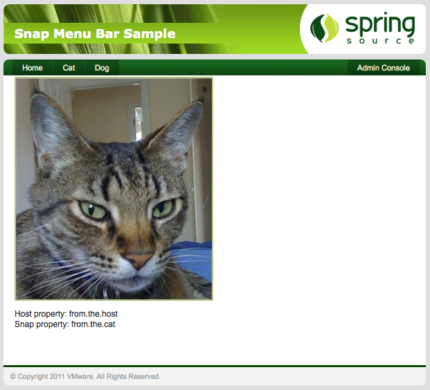
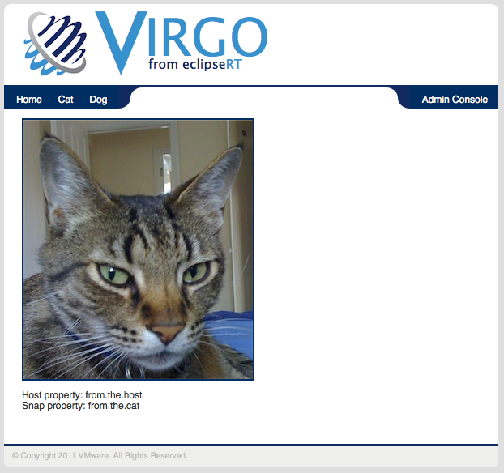

[[sample-application]]
== A Sample Application

The Virgo Snaps Zip file comes with a sample application that
you may have already deployed to verify your VS
install. In this chapter you will look at it in more detail to see how
an application can be composed and see all the Snaps features in action.

[[sample-application-structure]]
=== Structure of the sample application

The application is very simple, it consists of just a front end,
composed of four bundles, a host with three Snaps.

The host and three snaps show their `Snap-ContextPaths`. The Cat and Dog
snaps both contribute content while the final snap just contributes
styling information in the form of `css` files. The following sections
look at each of these in detail.

[[sample-application-host]]
=== The Host bundle

This bundle is very simple with no Java code. It defines the Snaps
filter in its `web.xml` just as you have seen in the
link:#using-snaps-configuring-the-host[Using Snaps] section. The menu
bar uses the taglibs support to render links for each registered Snap.

....
<ul>
    <li><a href="<c:url value="/"/>">Home</a></li>
    <snaps:snaps var="snaps">
        <c:forEach var="snap" items="${snaps}">
            <c:if test="${snap.contextPath ne '/styles'}">
                <li><a href="<c:url value="${snap.contextPath}${snap.properties['link.path']}"/>">
                    ${snap.properties['link.text']}</a>
                </li>
            </c:if>
        </c:forEach>
    </snaps:snaps>
</ul>
        
....

This is very similar to an example you have already seen. It puts the
links in a list and adds a link at the beginning to return to the host.
The properties it is referencing are located in the snaps themselves at
`/META-INF/snap.properties`.

[[sample-application-new-content]]
=== Adding New Content

If you now deploy both the Dog and Cat snaps, two new items will appear
on the menu bar, each providing content from their respective snaps.

If you look at the Cat page you will see it is also displaying some
properties. The Cat Snap is a little more complex, it has it's own
`DispatcherServlet` defined in its `web.xml` and a controller defined
using annotations. If you look at the controller code you will see where
these two properties come from.

....
@Controller
public class CatController {

    @RequestMapping("/meow")
    public ModelAndView cat(HttpServletRequest request) throws IOException {
        URL host = request.getServletContext().getResource("host:/WEB-INF/sample.properties");
        Properties host_props = new Properties();
        if(host != null){
            host_props.load(host.openStream());
        }
        URL snap = request.getServletContext().getResource("/WEB-INF/sample.properties");
        Properties snap_props = new Properties();
        if(snap != null){
            snap_props.load(snap.openStream());
        }
        return new ModelAndView("index").addObject("host", host_props.getProperty("some.property"))
                    .addObject("snap", snap_props.getProperty("some.property"));
    }
}
        
....

There are two properties files called `sample.properties` located at the
same path within both the Cat snap and the host. Each contains a
property called `some.property` but with distinct value. Looking at the
code above you can see the `host:` prefix being used to ensure the first
lookup only looks in the host and skips the snap. These values are then
placed in the Model for the JSP page to render.

[[sample-application-dynamic-styling]]
=== Re-styling

Finally the Blue styling snap shows how Snaps can be used in other ways.
Deploying this will cause all requests to `/styles` to be redirected and
the application will change in appearance but not content. All this
happens without re-deploying the host bundle, although you may need to
do a full refresh to clear your browser's cache.

This is the same page as before, being rendered by the host and the Cat
snap, but with the style information now coming from the Blue snap.
